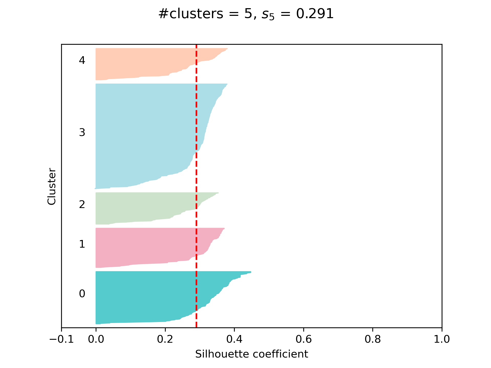

# Parallelized $k$-SCC

## What does this project do?

 In this project, based on [Dinh, et al., 2019, p. 1-17](https://link.springer.com/chapter/10.1007/978-981-15-1209-4_1), part of the $k$-SCC algorithm is parallelized, specifically the clustering step that, given a number of clusters, must be performed a sufficiently large number of times to avoid suboptimal solutions in the minimization of the cost function. All these processes for finding solutions of the cost function minimization problem, which are mutually independent, are carried out in parallel, and finally the optimal solution is chosen.

## Why is the project useful?

Because the computing time improves significantly. For example, on a computer with a 13th Gen Intel(R) Core (TM) i7-13700 processor (base speed of 2.10 GHz, 16 cores and 24 logical processors) the computing time goes from $20:09$ ($151.24 \frac{s}{it}$), with n_init=100 and n_jobs=1, to $2:29$ ($18.67 \frac{s}{it}$), the same 100 times but using all available threads.

## How to start with this project?

In the notebook there is the main loop that executes the $k$-SCC steps on the data set, as well as the visualization of the probabilistic centers for the optimal number of clusters.

Most of the libraries necessary to run this project are included in Anaconda by default: numpy, pandas, sklearn matplotlib and math. The tqdm library is also used to calculate the computation times of the main loop and thus observe the advantages of parallelization of the first step of the algorithm.

So you only need to have a data set of categorical variables in csv format and then run the notebook.
 
## Usage example

The $k$-SCC algorithm is used to divide a sample of 659 students enrolled in the Astronomy program at the University of Antioquia who took the Saber 11 exam between the 2017-1 and 2019-2 semesters. Clustering was done according to a set of 6 socioeconomic variables, 2 variables that report on the applicants' high school and the binary variable that indicates whether the applicant was admitted to the program.

Below you can see the silhouette diagram with $k=5$ clusters, the optimal number of clusters according to the silhouette score and the sufficient number of observations with a silhouette coefficient above the silhouette score.

Finally, the probabilistic centers are visualized in pie diagrams. Below are the probability distributions of the fifth cluster, which has 80 observations and corresponds to the applicants most likely to be admitted to the Astronomy program according to the model.

 

